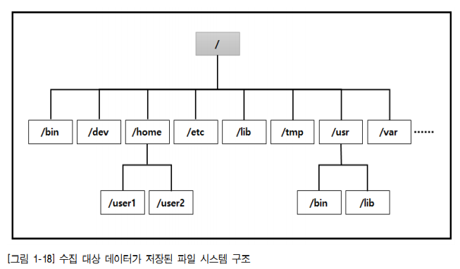
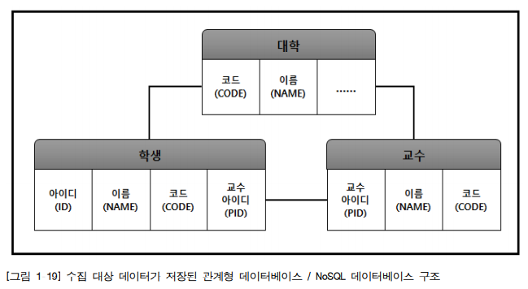
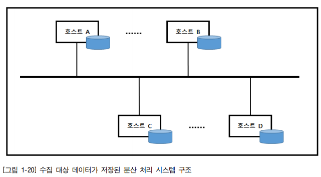
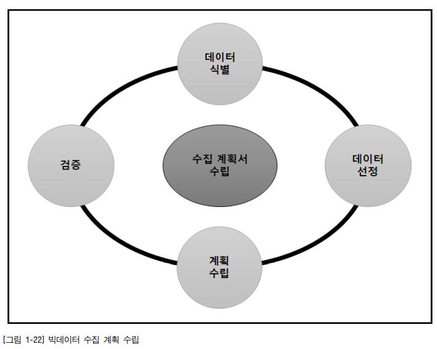
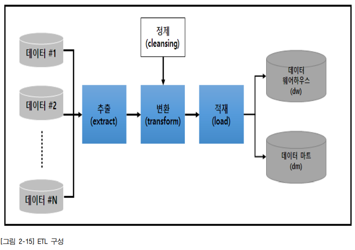
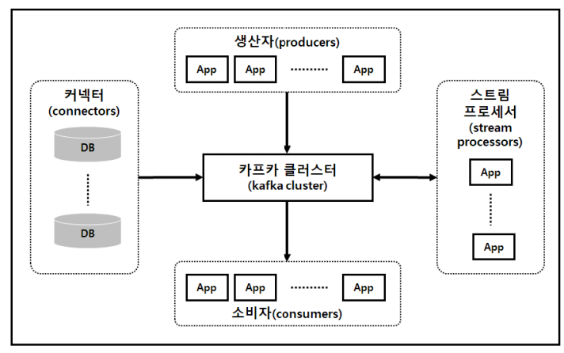
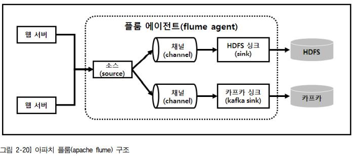
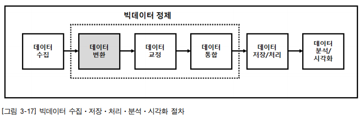
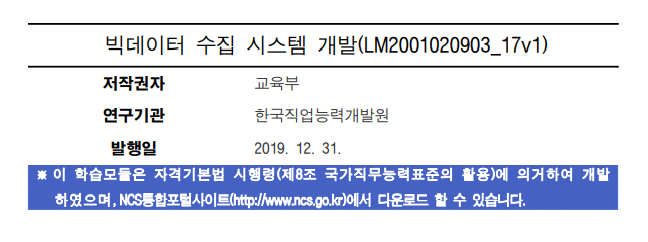

# 빅데이터 수집 시스템 개발

## 빅데이터 수집 시스템 설계하기

### 빅데이터 수집 방식의 정의 

**학습 목표** 

• 빅데이터 관련 기술 및 제품, 분석 방식을 조사하고 기존 시스템과의 연계를 고려하 여 데이터의 유형에 따른 빅데이터 수집 방식을 결정할 수 있다.

• 데이터 수집 모델을 설계하기 위하여 데이터 요구 사항 도출, 데이터 유형별 분류  및 특성을 파악할 수 있다. 

**필요지식**

#### 데이터 유형 및 특성 

빅데이터 수집 시스템의 수집 대상이 되는 데이터는 구조, 시간, 저장 형태 관점에 따라  분류할 수 있다

수집데이터

- 구조관점
  - 정형 데이터
  - 비정형 데이터
  - 반정형 데이터
- 시간 관점
  - 실시간 데이터
  - 비실시간 데이터
- 저장 형태
  - 파일 데이터
  - 데이터베이스 데이터
  - 콘텐츠 데이터
  - 스트림 데이터

**시간 관점의 데이터 유형** 

빅데이터 수집 시스템에서 수집 대상이 되는 데이터를 시간 관점(활용 주기)에서 분류하면 

- 실시간 데이터(realtime data), 

- 비실시간 데이터(non-realtime data) 또는 배치 데이터(batch  data)

의 두 가지로 나눌 수 있다. 

(1) 실시간 데이터(realtime data)

 실시간 데이터(realtime data)는 센서 데이터, 시스템 로그, 네트워크 장비 로그, 보안  장비 로그, 알람 등과 같이 생성된 이후 수 초 ~ 수 분 이내에 처리되어야 의미가 있는 **현재 데이터**를 말한다. 

(2) 비실시간 데이터(non-realtime data) 

비실시간 데이터(non-realtime data)는 통계, Web(웹) 로그, 서비스 로그, 구매 정보, 헬 스케어 정보 등과 같이 생성된 데이터가 수 시간 또는 수 주 이후에 처리되어야 의미 가 있는 **과거 데이터**를 말한다

**데이터베이스(database) 데이터** 

: 데이터베이스(database) 데이터는 관계형 데이터베이스(rdb–realtime database),  

- NoSQL(not only sql) 
- 인메모리 데이터베이스(in-memory dbms) 

등에 의해서 데이터의  종류나 성격에 따라 데이터베이스의 컬럼(column) 또는 테이블(table) 등에 저장된 데 이터를 말한다

**인메모리 데이터베이스(in-memory dbms)** 

느린 디스크 배제

이동하여 전체 메모리로 확보, 이 메모리로 모든 데이터를 올려서 

성능을 주요시 하는 db들은 인메모리 데이터베이스 사용

<u>개념</u>

디스크가 아닌 주 메모리에 모든 데이터를 보유하고 있는 데이터베이스. 

<u>장점</u>

디스크 검색[[1\]](https://namu.wiki/w/인 메모리 데이터베이스#fn-1)보다 자료 접근이 훨씬 빠른 것이 가장 큰 장점이다. 

데이터 양의 빠른 증가로 데이터베이스 응답 속도가 떨어지는 문제를 해결할 수 있는 대안이 인 메모리 데이터베이스이다. 

전형적인 디스크 방식은 디스크에 저장된 데이터를 대상으로 쿼리를 수행하지만, 

인 메모리 방식은 메모리상에 색인을 넣어 필요한 모든 정보를 메모리상의 색인을 통해 빠르게 검색할 수 있다.

<u>단점</u>

단점이라면 매체가 **휘발성**이라는 것. 

[DB 서버 전원이 갑자기 꺼져버리면](https://namu.wiki/w/뉴스데스크 게임 폭력성 실험 사건) 안에 있는 자료들이 [초고속즉시삭제](https://namu.wiki/w/초고속즉시삭제) 되어버린다. 

그래서 보통은 [로그인](https://namu.wiki/w/로그인) [세션](https://namu.wiki/w/세션) 같은, 서버가 꺼져서 날아가도 상관 없는 임시 데이터에 주로 쓰인다. 

거기다 속도 때문에 쓰는 것이기에 [압축 따윈 쓰지 않으며](https://namu.wiki/w/영웅은 공부 따원 안 한다네), 데이터에 비해 RAM 용량이 넉넉하지 않을 경우 [가상메모리](https://namu.wiki/w/가상메모리)를 쓰게 되어 역효과가 일어나기도 한다.

물론 [DBMS](https://namu.wiki/w/DBMS)의 속성 중 하나인 Durability (지속성)를 보장하기 위하여 

- Durability. **지속성**. : 성공적으로 완려된 트랜잭션의 결과는 시스템이 고장나도 영구적으로 반영된다.

메모리에 `INSERT/UPDATE/DELETE`된 값들은 모두 디스크에 로그로 기록하며, 

DBMS가 재구동될 때 디스크로부터 로그 파일을 읽어와 메모리에 DBMS 구조를 모두 재구축하기도 한다.

한편, 기존 DBMS 제품도 인 메모리 데이터베이스를 사용할 수 있는 옵션을 제공하기도 한다. [MySQL](https://namu.wiki/w/MySQL)/[MariaDB](https://namu.wiki/w/MariaDB)의 MEMORY 엔진이 그 중 하나.

> 출처 나무위키 인 메로리 데이터 베이스

#### 데이터 수집 방식

##### 파일 기반 수집 방식

| 수집 방식                               | 수집 방식 설명                                               | 데이터 종류                                    |
| --------------------------------------- | ------------------------------------------------------------ | ---------------------------------------------- |
| FTP (file transfer protocol)            | FTP 프로토콜(ftp, ftps, sftp)을 사용 하여 내·외부 시스템의 저장 파일 을 수집 시스템 내부에 다운로드 | 시스템 로그, 서비스 로그, 텍스트, 스프레드시트 |
| API(application  programming interface) | DBMS 제조사 또는 3rd Party Tool을  활용하여 내·외부 시스템의 DB 데이터를 제어 - 복사, 동기화, EXPORT | RDB, NoSQL,  In-memory DBM                     |

##### 통신 프로토콜 기반 수집 방식

통신 프로토콜 기반 수집 방식은 내·외부에 위치한 수집 대상 시스템에서 메모리 또는  휘발성으로 생성 또는 저장되어 있는 수집 대상 데이터를 원격지에서 통신 프로토콜을 통해 수집하는 방식이다. 

| 수집 방식    | 수집 방식 설명                                               | 데이터 종류                              |
| ------------ | ------------------------------------------------------------ | ---------------------------------------- |
| 소켓(socket) | 전송 계층 프로토콜인 TCP, UDP,  SCTP를 활용하여 네트워크 소켓 기 반으로 데이터를 수집 | 센서 데이터, 이진 데이터 트랜잭션 데이터 |
| **HTTP**     | 응용 계층 프로토콜인 HTTP를 활용 하여 웹 서버 등의 데이터를 수집 | 웹 데이터                                |

- 소켓 
- HTTP

#### 빅데이터 수집 방식 결정

수집 대상 데이터의 유형

- 정형 

- 비정형 

- 반정형 데이터

에 따라 빅데이터 수집 방식을 결 정하고 상세 수집 기술을 선정한다.

#####  정형 데이터에 대한 수집 방식 및 기술을 결정한다.

 (1) **관계형 데이터베이스(rdb) 데이터**를 수집하기 위한 수집 방식을 결정하고, 수집 기술을 선정한다. 

(2) **스프레드시트 데이터**를 수집하기 위한 수집 방식을 결정하고, 수집 기술을 선정한다. 

(3) **파일 데이터**를 수집하기 위한 수집 방식을 결정하고, 수집 기술을 선정한다. 

(4) **통계 데이터**를 수집하기 위한 수집 방식을 결정하고, 수집 기술을 선정한다

정형 데이터 수집 방식 및 기술

| 수집 방식 / 기술                             | 설명                                                         |
| -------------------------------------------- | ------------------------------------------------------------ |
| **ETL (extract transform load)**             | 수집 대상 데이터를 추출하여 가공(변환, 정제)하여 데이터 웨어 하우스에 저장하는 기술 |
| **FTP (file transfer protocol)**             | TCP/IP, UDP/IP 프로토콜을 통해 원격지 시스템으로부터 파일을  송수신하는 응용 프로그램 보안상의 이슈로 최근에는 sftp를 사용하도록 권고함. |
| **API (application programming  interface)** | 솔루션 제조사 및 3rd party 소프트웨어로 제공되는 도구로서,  시스템 간 연동을 통해 실시간으로 데이터를 수신할 수 있도록  기능을 제공하는 인터페이스 |
| DBToDB                                       | 데이터베이스 시스템(dbms) 간 데이터를 동기화 또는 전송하는  기능 제공 |
| 스쿱(sqoop)                                  | 관계형 데이터베이스(rdb)와 하둡(hadoop) 간 데이터 전송 기능  제공 |
| rsync                                        | 클라이언트(client) / 서버(server) 방식으로 수집 대상 시스템과  1:1로 파일과 디렉터리를 동기화하는 응용 프로그램 |

**ETL🌟🌟🌟**

서로 다른 RDBMS를 해당 DB에 맞게 만들어준다

- 예. 오라클 테이블을 mysql에 사용할 수 있는 테이블로 맞게 변환
  - 오라클과 mysql은 서로 다른 RDBMS

> 면접 질문) 서로 다른 데이터를 변환하는 방법?
>
> **ETL을 이용하여 데이터를 변경·적재**

**API (application programming  interface)🌟🌟🌟**

**스쿱**

db와 하둡간의 인터페이스

**rsync**

가장 원시적인 형태

##### 비정형 데이터에 대한 수집 방식 및 기술을 결정한다.

(1) 소셜 미디어 데이터를 수집하기 위한 수집 방식을 결정하고, 수집 기술을 선정한다. 

(2) NoSQL에 저장된 데이터를 수집하기 위한 수집 방식을 결정하고, 수집 기술을 선정 한다. 

(3) 웹 게시판의 데이터를 수집하기 위한 수집 방식을 결정하고, 수집 기술을 선정한다. 

(4) 미디어 데이터(텍스트, 이미지, 오디오, 비디오 등)를 수집하기 위한 수집 방식을 결 정하고, 수집 기술을 선정한다

| 수집 방식 / 기술        | 설명                                                         |
| ----------------------- | ------------------------------------------------------------ |
| 크롤링(crawling)        | 인터넷상에서 제공되는 다양한 웹 사이트로부터 소셜 네트워크  정보, 뉴스, 게시판 등으로부터 웹 문서 및 정보 수집 |
| RSS (rich site summary) | 블로그, 뉴스, 쇼핑몰 등의 웹 사이트에 게시된 새로운 글을 공 유하기 위해 XML 기반으로 정보를 배포하는 프로토콜 |
| Open API                | 응용 프로그램을 통해 실시간으로 데이터를 수신할 수 있도록  공개된 API |

### 빅데이터 수집 모델 설계 및 검증 

**학습 목표**

• 데이터 유형별 특성에 부합하는 데이터 모델, 수집 기능 및 제약 조건을 설계할 수  있다. 

• 완료된 데이터 수집 모델 설계에 대한 결과의 타당성을 검증할 수 있다

#### 수집 데이터의 위치

- 내부 데이터
- 외부 데이터
- 혼합 데이터

#### 수집 대상 데이터의 저장 방식

##### 파일 시스템

수집 대상이 되는 데이터가 다수의 파일 형태로 파일 시스템에 구조화되어  저장된 파일 기반의 수집 대상 데이터

##### 관계형 DBMS / NoSQL DBMS 

수집 대상이 되는 데이터가 

데이터를 대표하는 유일성을  내포하는 키(key)를 기반으로 구조화되어 관계형 데이터베이스에 저장되어 있거나 

스키마  구조가 없는 NoSQL 데이터베이스에 저장되어 있는 수집 대상 데이터

##### 분산 처리 데이터 

수집 대상이 되는 데이터들이 물리적으로 분리된 다수의 시스템에 분산되어 저장된 분산 시스템 기반의 수집 대상 데이터

- 네트워크에 많은 트레픽이 있으면, 병목(**bottleneck**) 현상 발생
  - 많은 io발생(데이터들이 막 돌아다니면)해서 병목현상 생긴다
  - bandwidth 넓혀주어야함
  - 병목현상 : 병의 목이 좁으니까 좁은 공간에 인구가 몰리면 교통체증이 생기는 현상

#### 빅데이터 수집 모델 설계 및 검증하기

##### 수집 데이터 검증 방안

검증 방안 특징 데이터 종류 

순서 번호 (seq no.) 

수집 데이터 단위별 연속된 번호 

스트림(stream) 

네이밍 규칙 (naming rule) 

파일명에 연속된 번호 또는 시간 정보를 포함 

파일(file), 콘텐츠(content) 

메타데이터 

별도의 파일 또는 헤더에 개수, 용량, 기간, 순서 번호(seq No) 등을 수록 

파일(file), 콘텐츠(content) 

체크섬 (checksum) 

데이터에 대한 체크섬(checksum) 정보 별도 제공 

스트림(stream), 파일(file), 콘텐츠(content

## 빅데이터 수집 시스템 구성하기

### 수집 시스템 구조 파악

**학습 목표** 

• 수집된 데이터의 안정성과 신뢰성을 보증하는 수집 시스템 구조를 파악할 수 있다

#### 빅데이터 수집 시스템 하드웨어

##### 연산 장치 

빅데이터 수집 시스템을 구성하는 연산 장치는 입력된 데이터의 연산을 처리하는 장치이며,

 CPU(central processing unit)가 대표적인 연산 장치이다. 

CPU를 제조하는 대표적인 제조사는 

- 인텔 

- AMD

- ARM이 있으며, 

빅데이터 수집을 위한 처리 시스템에서는 일반적으로 x86계열의 인텔 CPU를 기반으로 구성되어 있다. 

빅데이터 수집 시스템에서 데이터 처리 성능을 높이기 위해서는 

- CPU 동작 클록 주파수(clock frequency)

- 연산 수행을 위한  코어(core) 개수가 중요하다

##### 저장 장치 

**저장 장치 유형**

구분 : 테이프 기반 

유형 : 자기 테이프 (magnetic tape)

설명 : 플라스틱 테이프 표면에 자성 재료를 바른 테이프 순차 접근만 가능하며, 데이터 이용이 불편 가격이 저렴하고 용량이 커 데이터 백업용으로 사용됨. 

구분 : 디스크 기반 

유형 : HDD (hard disk drive) 

설명 : 금속 재질의 플래터 표면에 코팅된 자성체에 데이터를  기록하며, 비휘발성임. 가격이 저렴하고, 대용량을 제공하여 대중적으로 사용 되는 저장 장치 

구분 : 메모리 기반

유형 : SSD (solid state drive)

설명 : HDD 대비 높은 데이터 전송 속도와 신뢰성, 저전력, 호 환성 등을 제공 HDD 대비 고가이나, 최근 가격 하락으로 높은 I/O를 요 구하는 경우 HDD를 대신하여 사용됨. 

유형 : SSD NVMe 

설명 : SSD 대비 PCIe / SATA 기반의 통신 인터페이스를 제공 하며, SATA 기반의 SSD에 대비하여 3~5배의 높은 성능 을 제공

##### 네트워크 저장 장치(network storage)

**SAN** (storage area network)

호스트와 스위치, 스토리지 기기로 구성되며, 

파이버(Fiber) 채널을 기반으로 SAN 네트워크 구성을 통해 고속의 데이터 통신을 통해 장치 간에 블록 단위로 데이터를 공유 하는 네트워크 스토리지 장치

**NAS** (network attached network)

스토리지 사용 시스템과 네트워크 스토리지가 동일 네트워크로 구성되어,

네트워크를  통해 파일 단위로 데이터를 공유한다. 서로 다른 네트워크 클라이언트에 데이터 접근  권한을 제공하는 네크워크 스토리지 장치이다

### 수집 시스템 구성 

학습 목표 

• 일괄 처리 데이터의 특성을 감안하여 빅데이터 수집 시스템을 구성할 수 있다. 

• 실시간 데이터의 특성을 감안하여 빅데이터 수집 시스템을 구성할 수 있다 

• 주어진 테스트 절차에 의해 데이터 수집 관리 시스템 정상 설치 여부를 검증할 수 있다.

#### 정형 데이터 수집 기술 

##### ETL 

ETL의 정의

ETL은 데이터 분석을 위한 데이터를 데이터 저장소인 DW(data warehouse) 및  DM(data mart)으로 이동시키기 위해 다양한 소스 시스템으로부터 필요한 <u>원본 데이터 를 추출(extract)하고 변환(transform-변화, 정제)</u>하는 작업 수행하여, 타깃 시스템 (target system)으로 전송 및 적재(load)하는 모든 과정을 통칭한다. 

ETL 구성도

데이터 마트

- 분석하기 위해 데이터를 나에게 맞게 만들어둔것

#### 비정형 데이터 수집 기술

##### 아파치 카프카(apache kafka)

카프카는 대용량 실시간 로그 처리를 위해 기존 메시징 시스템과 유사하게 레코드 스트림을 발행(publish), 구독(scribe)하는 방식의 분산 스트리밍 플랫폼

#### 반정형 데이터 수집 기술 

##### 아파치 플룸

플룸은 많은 양의 로그 데이터를 효율적으로 수집, 집계 및 이동하기 위해 이벤트 (event)와 에이전트(agent)를 통해 스트리밍 데이터 흐름(data flow)의 비동기 방식 아키텍처 기반 분산형 로그 수집 서비스

## 빅데이터 수집·변환 모듈 개발하기

### 빅데이터 수집 모듈 개발 

학습 목표 

• 수집 대상 데이터의 유형별 접근 방식에 따라 데이터를 수집하는 모듈을 작성할 수 있다.

### 빅데이터 변환 모듈 개발 

학습 목표 

• 수집된 데이터를 대상으로 실제 시스템에서 사용하기 용이한 형식으로 변환하는 모 듈을 구현할 수 있다

#### 수집된 반정형·비정형 데이터

 내·외부 시스템에서 수집되는 데이터에는 반정형 데이터와 비정형 데이터 비중이 높다.  특히, 외부 시스템으로부터 수집되는 데이터는 HTML, XML, JSON의 형태로 표현되어 있다.

##### JSON(java script object notation)

JSON의 정의 

브라우저와 서버 간 비동기 통신을 위해 이름(name)과 값(value)의 데이터를 표현하는  텍스트 데이터 포맷이다.  

JSON의 특징 

(가) 이름과 값을 쌍으로 구성하여 구조가 단순하다.  (이름, 값) 쌍

(나) 데이터 구조를 함축적으로 표현하여 빠른 데이터 송수신이 가능하다. 

(다) 자바 스크립트 구문 형식을 준수한다. 

(라) 프로그래밍 언어나 플랫폼에 독립적이다

JSON 형식

#### 빅데이터 수집 및 변환 모듈 언어

##### 파이선(python)

객체 지향적이고 플랫폼 독립적이며, **인터프리터 방식**의 고급 프로그래밍 언어이다

> **기계가 이해할 수 있게 번역하는 방식**

- 인터프리터 방식
- 컴파일 방식

>  **인터프리터 ↔  컴파일 서로 상반되는 개념**

인터프리터 : 한줄씩 줄 단위로 컴퓨터에게 번역 (소스 코드를 바로 실행하는 컴퓨터 프로그램 또는 환경)

- 파이썬

컴파일 : 프로그램 뭉치 자체를 통째로 번역

- Java, C

#### 빅데이터 변환 모듈 개발하기

##### 수집된 빅데이터 변환 모델을 설계

내·외부 시스템에서 수집되는 데이터에는 반정형과 비정형 데이터가 많이 포함되어 있다.  반정형과 비정형 데이터를 구조화된 정형 데이터로 변환하고, 변환된 데이터에서 오류값 을 수정하는 과정이 필요하며, 이를 정제라고 한다.

1. 데이터 변환 

데이터 유형을 변환하거나, 데이터 분석이 용이한 형태로 데이터를 변환한다. (ETL)

(1) 수집된 데이터에서 유의미한 정보를 추출(extraction)한다. 

(2) 수집된 데이터의 형태, 포맷, 표현 방식을 변환(transformation)한다. 

(3) 변환된 데이터를 적재(loading)한다. 

2. 데이터 교정 

수집된 데이터가 비정형 데이터인 경우 반드시 수행해야 한다. 

(1) 결측치 변환 수집된 데이터에서 정보가 누락되어 있거나, 비어 있는 값을 찾아 제거한 후, 분석한다. 

​	(가) 결측치를 많이 포함한 관측치를 제거한다. 

​	(나) 특정 변수가 매우 많은 결측치를 가진다면, 해당 변수를 삭제한다. 

​	(다) 결측치를 평균값, 중앙값, 최빈값으로 대체한다. 

​	(라) 예측(prediction)을 통해 결측치를 대체한다. 

(2) <u>이상치</u> 제거 (outlier 제거)

이상치는 관측된 데이터의 범위에서 많이 벗어나는 값을 의미한다. 의미 있는 결과 분 석을 위해서는 반드시 <u>제거해야</u> 한다. 

(3) <u>노이즈데이터</u> 제거 

​	(가) Moviing Average Filter를 이용하여 주위 값들에 비해 높거나 낮을 경우 평균값 을 대체한다. 

​	(나) Median Filter를 이용하여 일정 범위 중간값을 해당 지점의 값으로 지정한다. 

​	(다) Curve Fitting and Splines를 이용하여 최적 파형을 기준으로 해당 파형에 유사한  신호를 검출한다. 

​	(라) Digital Filter를 이용하여 고정된 시간 간격 단위로 처리한다. 

​	(마) Pivoting을 이용하여 피봇(pivot)을 기준으로 카운팅하여 새로운 통계값을 생성한다. 

3. 데이터 통합 

데이터 분석이 용이하도록 기존 또는 유사 데이터를 연계하고 통합한다. 다음 기준으로  데이터를 통합한다. 

(1) 수집된 데이터의 성격이 유사하면, 데이터를 통합한다. 

(2) 엔티티의 기본 속성이 유사하면, 데이터를 통합한다. 

(3) 수집된 데이터들이 조회 및 처리 수행할 때 연관되면, 데이터를 통합한다. 

(4) 수집된 데이터 간에 관계 및 의존성, 계층 관계가 있으면, 데이터를 통합한다. 

(5) 수집된 데이터 간에 공통적인 정보 및 속성이 존재하면, 데이터를 통합한다.

