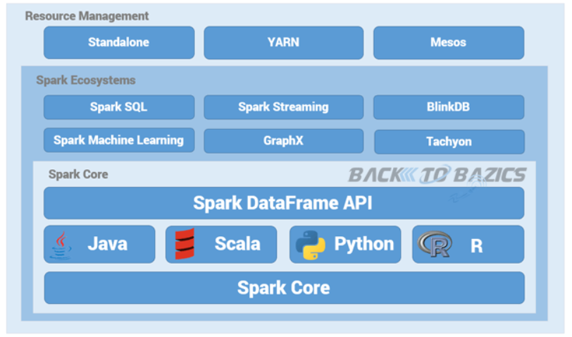

# SPARK

## SPARK Vs. Hadoop MapReduce

스파크 : 메모리 기반 분석 플랫폼

하둡 : 디스크기반 분석 플랫폼

|             | SPARK                                                 | HadoopMapReduce           |
| ----------- | ----------------------------------------------------- | ------------------------- |
| 속도        | 100 X                                                 | 빠름                      |
| 처리방식    | 실시간 프로세싱                                       | 배치 프로세싱             |
| 데이터 저장 | 메모리 저장 방식                                      | 디스크 저장 방식          |
| 구현 언어   | Scala                                                 | Java                      |
| 특징        | HDfS + MapReduce 처리 엔진                            | 전통적인 대용량 처리 방식 |
| 단점        | OLTP보다는 OLAP 처리 효율적, 메모리 분산으로 overhead | Disk overhead             |

- OLTP = real time batch program
- OLAP


## SPARK의 탄생 배경

1. 기존의 빅데이터 시스템의 성능
2. 개발의 어려움
3. 통합환경의 필요성

SPARK 정의

-  고속 범용 분산 컴퓨팅 플랫폼

SPARK = HDFS + MapReduce 처리 엔진


## SPARK 환경의 장점

사용편의성

- 맵리듀스 대비 code간결
- Java, Scala, Python, R and SQL

통합플랫폼 제공

- 스파크 core, 스파크 스트리밍, 스파크 ML, 스파트 SQL, 스파크 GpaphX

분할 처리

RDD (Resilient Distributed Dataset) 🌟

- 탄력있는 분할된 데이터
- Mini batch RDD 사용
- 스파크의 가장 큰 장점


## SPARK의 핵심

SPARK / Hadoop 구조

Simple Spark Structure




Simple Hadoop Structure


## 스파크 구성 컴포넌트

spark Core

- spark job관리, 다른 컴포넌트 필요 기능 제공

spark Streaming

- 실시간 스트리밍 데이터 처리
- Dstream (Discretized Stream) 
  - 이산 스트림 개념을 제시하여, 시간별로 도착한 데이터들의 연속적인 모임. RDD의 연속적인 묶음이라 할 수 있다.

spark MLib

- 로지스틱 회귀, 나이브 베이즈 분류, SVM, 의사 결정 트리, Random Forests, 선형 회귀, K-Means Clustering 제공

spark SQL

- spark 제공 SQL 사용, hiveQL에서 제공하는 SQL 사용하여 대규모 정형 데이터 처리

spark GraphX

- Graph data 연산 제공


p61

```
val licLines = sc.textFile("/usr/local/spark/LICENSE")
val lineCnt = licLines.count()
```


p63

특징

불변성 복원성 투명성


p64

RDD연산자 

- 변환 연산자
- 행동 연산자

p65

```
# val numbers = sc.parallelize(range(10, 51, 10))
val numbers = sc.parallelize(10 to 50 by 10)

# numbers.foreach(lambda x: print(x))
numbers.foreach(x => println(x))

# val numbersSquared = numbers.map(lambda num: num * num)
val numbersSquared = numbers.map(num => num * num)

# numbersSquared.foreach(lambda x: print(x))
numbersSquared.foreach(x => println(x))
```


p67

```
echo "15,16,20,20
77,80,94
94,98,16,31
31,15,20" > ~/client-ids.log
```


```
val lines = sc.textFile("/home/spark/client-ids.log")
val idsStr = lines.map(line => line.split(","))
idsStr.foreach(println(_))
idsStr.first()
idsStr.collect()
```


p71

sample은 ~ 연산자다

sample

p72

takesample

p73

take

연잔자 : sampel, takesample, sample
