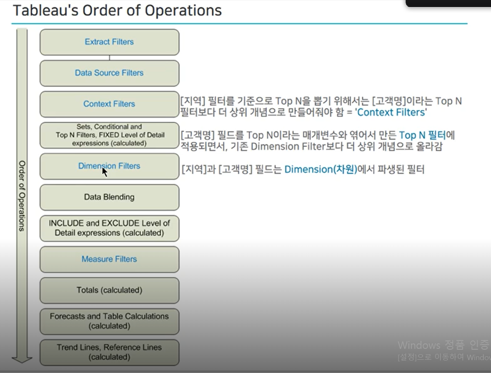

# 데이터 시각화를 위한 태블로

>  https://www.boostcourse.org/ds121/joinLectures/286344

## CHAPTER 1. 태블로 이해하기

### Ep1. 디지털로의 전환

**학습 목표**

\- 불확실성이 높은 현 시점에 기업과 각 구성원들의 당면과제를 살펴봅니다. 

 

**핵심 키워드**

\- 디지털 트랜스포메이션 (Digtial Transformation)

\- 데이터 리터러시 (Data Literacy)

\- 데이터 시각화 Data Visualization


**학습 내용**

요즘 기업에서 가장 큰 화두는 Digital Transformation입니다.
Digital Transformation이란 디지털로 변신(변혁)을 한다는 뜻입니다.
예전에는 전통적인 회사들이 제조업, 금융업, 융통업처럼 하나의 분야에서 성장하는 방식이었다면
이제는 모든 산업 분야 및 회사들은 IT를 기반으로 변화하고 있습니다.

기업과 구성원들의 당면 과제인 디지털 트랜스포메이션과 데이터 리터러시에 대해서 살펴봅니다.


**Data Literacy란**

**= 데이터를 보고 활용할 수 있는 능력**

데이터를 보는(See) 것이 아니라

**탐색(Explore)**을 통해

자신이 **이해(Understand)**하고,

이를 다른 사람과 **대화(Communication)**와

**협업(Collaboration)**을 통해 찾은

**통찰(Insight)**을 **공유(Share)**하는 능력


**태블로 활용 방식**

1. SAP 데이터를 Tableau에서 바로 연결하고 실시간으로 데이터의 흐름을 추적
2. 태블로 desktop에서 시각적 분석을 한 뒤,
3. 태블로 서버로 공유하는 형식


> 태블로 도입 전

1. SAP 데이터 다운로드 받고
2. 엑셀에서 가공한 뒤
3. ppt나 엑셀에서 시각화하는 방식


**데이터 시각화**

데이터에 색상과 모양 그리고 사람들의 시선을 끌 수 있는 요소를 배치해 데이터를 시각적으로 표현하는 것


**데이터 시각적 분석**

데이터 시각화를 통해 스토리텔링 및 인사이트를 찾는 분석 기법


#### **wrap-up**

**DT**

- 디지털 트랜스포메이션
- 기업 당면 과제
- 산재되어 있는 데이터를 집중화시키고, 비즈니스에 적극적으로 활용할 수 있도록 하고 데이터에 대한 내무 문화 바뀌도록 유도

**DL**

- 데이터 리터러시
- 기업 구성원의 당면 과제
- DT로 마련한 데이터를 개인들이 언제나 접근해 비즈니스 인사이트를 빠르게 발굴하는 능력

**DV**

- 데이터 비주얼리제이션
- 데이터 리터러시를 강화하는 방법
- 데이터를 시각적으로 표현하고 찾은 인사이트를 조직 내 공유 및 협업하는 과정


### Ep2. 태블로 이해 및 설치하기

**학습 목표**

\- 태블로의 현재 및 장점을 알아보고 앞으로 발전하는 방향을 알아봅니다. 그리고 태블로 퍼블릭을 설치하고 실습할 준비를 마칩니다.

 

**핵심 키워드**

\- 태블로 (Tableau)

\- BI (Business Intelligence)

\- 끌어다 놓기 (Drag & Drop)

\- 태블로 퍼블릭 (Tableau Public)


**태블로?**

태블로란 Business Intelligence (BI) 솔루션

- 사람들이 데이터를 보고 이해할 수 있도록 도운다

- 데이터 분석 분야의 신뢰받는 리더


**태블로 장점**

- Drag & Drop을 통한 탐색적 분석 및 시각화
- 데이터 원본에 없는 필드를 직접 생성 가능
  - 내장 함수 이용
- 다양한 형태의 시각화

- 공유와 협업이 어느 곳에서나 가능 
  - 모바일 대시보드
- 자연어 분석 및 처리에 집중


**태블로 퍼블릭 설치하기**

>  https://public.tableau.com/ko-kr/s/

- 완전 무료, 완전 공개의 특징
- 대시보드를 제작하는데 필요한 래퍼런스 얻는 데에도 유용

- 이미 제작된 대시보드를 다운로드 가능


**데이터 연결하기**

- SUPERSTORE_2018-2021


**학습 내용**

태블로는 스스로 데이터를 보고 이해하는 셀프 서비스의 분석 영역에서

조직과 조직 구성원이 데이터를 활용하는데 도움을 줍니다.
현재 태블로는 데이터 분석 분야의 신뢰받는 리더로서
사람과 조직이 한층 더 데이터 기반의 의사 결정을 할 수 있도록 지원합니다.
(*2021년 기준 9년 연속 Gartner가 선정한 Data Visualization and Business Intelligence 분야의 Leader)


여기에서는 Tableau Public을 설치 후 실습을 진행합니다.


### Ep3. 태블로 기본 컨셉 이해하기_1

**학습 목표**

\- 태블로의 기본 컨셉인 측정값과 차원을 알아보고 가장 기본적인 비주얼리제이션인 막대 차트를 만들어봅니다. 

 

**핵심 키워드**

\- 측정값 (Measures)

\- 차원 (Dimensions)

\- 막대 차트 (Bar chart)


**학습 내용**

태블로의 가장 기본 컨셉 중 하나는 측정값과 차원입니다. 

측정값은 기본적으로 숫자형식이고 집계를 통해 한 덩어리가 만들어지며,

차원은 그 한 덩어리를 세부적으로 나누어서 보는 기준이 됩니다. 

또한 태블로에서 가장 기본적인 비주얼리제이션은 막대 차트입니다.

태블로에서는 측정값에 있는 데이터 원본 필드 중
초록색 연속형 필드(지리적 역할인 위도, 경도는 제외)를 더블 클릭하면
기본적으로 막대 차트가 만들어집니다.

기본적으로는 집계 방식을 통해 우선 차트를 만들고
이것을 분할해서 보는 기준은 차원의 값으로 결정되는데,
그 출발은 막대 차트부터 시작하게 됩니다.


**태블로 기본 컨셉**

1. 차원 VS 측정값
2. 불연속형 VS 연속성


**차원 VS 측정값**

- 측정값 <초록>
  1. **숫자**형식
  2. **액션**(drag n drop 또는 double-click)을 통해
  3. 설정된 **집계**에 따라
  4. **차트** 생성

- 차원 <파랑>
  1. 그 숫자들로 만들어진 차트를
  2. 어떻게 나눠서 볼 것인지를 결정


**막대차트**

- 막대 차트 만드는 이유
  1. 만들기 쉽다
  2. 항목별로 나눠서 보는데 적합
  3. 카테고리(범주), 순위, 추세를 보는데 유용

- 막대 차트 만드는 방식
  - 태블로에서 측정값에 있는 초록색 연속형 필드 (지리적 역할인 위도, 경도 제외)를 더블 클릭하면 기본적으로 막대 차트가 만들어짐
  - 기본적으로는 집계 방식을 통해 우선 차트를 만들고 이것을 분할해서 보는 기준은 차원의 값으로 결정
  - 그 출발은 막대 차트부터 시작하게 됨(권고)


### Ep4. 태블로 기본 컨셉 이해하기_2

**학습 목표**

\- 태블로의 기본 컨셉인 연속형과 불연속형에 대해 알아보고 가장 기본적인 비주얼리제이션 중 하나인 라인 차트를 만들어봅니다. 

 

**핵심 키워드**

\- 연속형 (Continuous)

\- 불연속형 (Discrete)

\- 라인 차트 (Line chart)

\- 평균 라인 (Average line)


**학습 내용**

태블로에서는 데이터 원본의 열(Column)에서 만들어진 필드를 불연속형(파란색)인지, 아니면 연속형(녹색)인지에 따라 뷰에서 다르게 표시하게 됩니다.

예를 들어서 연속형은 무한대로 끊어지지 않고 이어지는 성격이라면, 불연속형은 값은 유한하며 개별적으로 구분되는 속성이 있습니다.


라인 차트는 처음부터 해당 영역까지 기본적으로 연결하는 속성이 강합니다.

따라서 시간 베이스의 추세를 살펴보는데 적합합니다.

라인 차트에도 불연속형과 연속형이 있으며, 각각 적용되는 함수도 다르고 뷰에서 표현하는 방식도 다릅니다.


라인 차트는 전반적인 추세를 보는 경향이 강한 차트이며,

불연속형은 DATEPART 함수를, 연속형은 DATETRUNC 함수가 적용됩니다.


 **태블로 기본 컨셉**

1. 차원 VS 측정값
2. 불연속형 VS 연속성


**불연속형 VS 연속성 (1) - 색상 구분**

- 불연속형 : 분절형
- 연속형 : 그라데이션


**불연속형 VS 연속성 (2) - 라인 그래프**

불연속성

- DATEPART('quarter', [주문 일자])
  - (날짜_부분, 날짜, [주시작])

연속성

- DATETRUNC('quarter', [주문 일자])
  - 롤업(rollup) 기준


#### wrap-up

**불연속형은?**

**파란색 필드** = **불연속형** = **개별적**으로 구분

<u>**유한한**</u> 범위, 뷰에 추가하면 **머리글**을 추가함

**Discrete** = **Blue, Separate** and **distinct, finite**

Discrete fields draw **headers**.


**연속형은?**

**초록색 필드** =**연속형** = 단절이 없고 **끊어지지 않는**
**<u>무한대</u>** 범위, 뷰에 추가하면 **축**을 추가합니다.

**Continuous** = **Green, unbroken, without interruption, infinite**

Continuous fields draw **axes.**


**라인 차트**

- 라인 차트 만드는 이유
  1. 시간 순서에 따른 추세를 보는데 적합
  2. 만들기 쉽다 ((더블)클릭만으로 가능)

- 라인 차트를 만드는 방식?
  - [날짜] 유형 필드를 활용하면 간단하게 만들 수 있다
    - 여기에서도 연속형과 불연속형 개념을 잘 이해하기


## CHAPTER 2. 태블로 기초 이해

### Ep.5 태블로 부분 전체 분석

**학습 목표**

\- 전체에서 각 멤버들의 비중을 구할 때 적합한 방식인 부분 전체 분석 (Part-to-Whole charts)에 대해서 알아봅니다.

 

**핵심 키워드**

\- 누적 막대 차트 (Stacked Bar chart)

\- 파이 차트 (Pie chart)

\- 도넛 차트 (Donut chart)

\- 트리맵 (Treemap)

\- 퀵 테이블 계산 (Quick Table calculation)

\- 구성 비율 (Percent of Total)

 

**학습 내용**

부분 전체 분석은

전체에서 각각의 멤버들의 값이 어느 정도의 비율을 차지하는지 살펴보는데 적합합니다.

다만, 멤버가 많은 경우에는 파이 차트나 도넛 차트 구성은 가급적 피하는 것이 좋으며

이 경우에는 트리맵을 대안으로 적용해보시기 바랍니다


**부분 전체 분석**

1. 누적 막대 차트
2. 파이 차트
3. 도넛 차트
4. 트리맵

- 전체에서 각각의 멤버들의 값이 어느 정도의 비율을 차지하는지 살펴보는데 적합
- 다만, 멤버가 많은 경우에는 파이 차트나 도넛 파트 구성은 가급적 피하는 것이 좋으며
- **이 경우 트리맵을 대안으로 적용**


### Ep.6 태블로 상관 관계 분석

**학습 목표**

\- 분산형 차트는 측정값 간의 관계를 파악하기 위한 시각화의 한 방식입니다. 

\- AI 의 힘을 활용하여 뷰 내의 특정 요소를 설명함으로써 기존에 찾지 못했던 왜 (Why) 를 발견하도록 도와주는 데이터 설명 기능에 대해서 알아봅니다.

 

**핵심 키워드**

\- 분산형 차트 (Scatter plot)

\- 데이터 설명 (Explain data)

\- 매개 변수 (Parameter)


**학습 내용**

분산형 차트는 측정값 간의 관계를 파악하기 위한 시각화의 한 방식입니다.

열 선반과 행 선반에 각각 측정 값을 배치하면 자동적으로 분산형 차트가 만들어집니다.

열 선반과 행 선반에 올리는 필드는 고정적으로 배치가 가능하지만, 좀 더 자유도를 주고자 별도의 매개 변수를 만들면 매개 변수 값에 따라 분산형 차트를 다양하게 활용할 수 있습니다.

데이터 설명 및 매개 변수와 함께 활용하시면 좀 더 다양한 결과를 확인하실 수 있습니다


**상관 관계 분석**

1. 분산형 차트
2. 데이터 설명
3. 매개 변수 적용


#### wrap-up

분산형 차트는 측정값 간의 관계를 파악하기 위한 시각화의 한 방식

**열 선반과 행 선반에 각각 측정값을 배치하면 자동적으로 분산형 차트(🔵)가 만들어진다.**

열 선반과 행 선반에 올리는 필드는 고정적으로 배치가 가능하지만,

좀 더 자유도를 주고자 별도의 매개변수를 만들면 매개 변수 값에 따라 분산형 차트를 다양하게 활용할 수 있다.


### Ep.7 태블로 이중 축 vs 결합된 축

**학습 목표**

\- 축을 이중으로 활용하는 이중 축과 하나의 축을 공유 또는 결합하는 결합된 축의 차이점과 활용법에 대해서 살펴봅니다.

 

**핵심 키워드**

\- 이중 축 (Dual Axis)

\- 결합된 축 (Combined Axis)


**학습 내용**

**이중 축 (Dual Axis)**은

하나의 뷰 안에서 축을 이중으로 써서 차트를 만드는 경우이며

이중 축은 마크를 서로 다르게 구성이 가능합니다.

반면에

**결합된 축 (Combined Axis)**은

하나의 뷰에서 같은 축을 결합 또는 공유하는 케이스이며

결합된 축은 마크가 동일하게 구성됩니다.


**이중 축 (Dual Axis) VS 결합된 축 (Combined Axis)**

1. 이중 축
2. 결합된 축
3. 이중 축 & 결합된 축 동시 적용


**이중축**

- 하나의 뷰 안에서 축을 이중으로 사용하여 차트 생성
- 이중 축은 마크를 서로 다르게 구성 가능

**결합된 축**

- 하나의 뷰에서 같은 축 결합 또는 공유 
- 결합된 축은 마크가 동일하게 구성


### Ep.8 태블로 그룹 vs 집합

**학습 목표**

\- 여러 항목들을 묶어서 관리할 때 활용하는 그룹(Group)과 집합(Set)에 대해서 살펴봅니다. 

 

**핵심 키워드**

\- 그룹 (Group)

\- 집합 (Set)

\- 결합된 집합 (Combined Set)


**학습 내용**

**그룹**은 항목들을 여러 그룹으로 묶을 수 있지만

**집합**은 집합에 포함(IN)되는지 아닌지(OUT)으로만 구분합니다.


또한 집합을 두 개 만든 다음에 이들을 결합해서 별도의 집합으로 만들 수 있습니다. 

이 때 벤다이어그램 기준으로 집합의 모습에 따라 교집합, 합집합, 여집합으로 결합된 집합을 활용할 수 있습니다. 


**그룹 VS 집합**

1. 그룹(Group) 이란?
2. 집합 (Set) 이란?

- **그룹** : 항목들을 여러 그룹으로 묶기 가능
- **집합** : 집합에 포함 (IN) ↔ 집합에 포함 아님(OUT) 구분


### Ep.9 태블로 테이블 구성하기_계층과 총계

**학습 목표**

\- 화면을 세부적으로 살펴보기 위한, Drill-down을 편리하게 살펴볼 수 있는 계층과 총계에 대해서 살펴봅니다. 

 

**핵심 키워드**

\- 계층 (Hierarchy)

\- 총계 (Total)

\- 드릴 다운 (Drill-down)


**학습 내용**

**계층(hierarchy)** 은 화면에서

드릴 다운(Drill-down)해서 값을 세부적으로 찾는 데 유용합니다.

**총계(Total)**는 각각의 요소들의 총 값을 보여주는 방식으로 범위에 따라

총합계 및 소계, 그리고 열과 행 기준으로 각각 TOTAL을 표시할 수 있습니다.


**테이블 구성하기**

1. 계층 만들기
2. 총계 만들기

- **계층** : 화면에서 **Drill-Down**해서 값을 세부적으로 찾는데 유용
- **총계** : 각각 요소의 **total**을 보여주는 방식. 범위에 따라 총 합계 및 소계 / 열과 행 기준으로 각각 total 표시 가능 


### Ep.10 태블로 맵 만들기

**학습 목표**

\- Tableau에서 우리나라 지명을 기준으로 맵 형태로 표현해 봅니다. 

 

**핵심 키워드**

\- 맵 차트 (Map chart)

\- 지리적 역할 (Geographic role)

\- 계층 (Hierarchy)


**학습 내용**

Tableau에서는 맵 형태로 데이터를 표현할 수 있습니다.

우리나라 지리 정보가 있다면 기본적으로는 시도와 시군구명만 있더라도

태블로에서 맵 형태로 표현이 가능합니다.

또한 시군구 기준으로는 같은 이름이 있는 경우에는 맵에서 제대로 표현하기 위해

상위 레벨인 시도와 계층을 설정하는 것이 중요합니다.

그 외에 읍면동이라든지 지점 위치를 표현하고 싶다면

위도와 경도 값을 갖고 있거나,

별도의 공간 파일(shp파일)과 조인해서 표현 가능합니다.


**맵 만들기**

1. 지리적 역할 부여하기
2. 맵 차트 구현하기


#### wrap-up

- 태블로에서는 맵 형태로 데이터 표현 가능
- 우리나라 지리 정보가 있다면 기본적으로는 **시도와 시군구명**만 있더라도
- 태블로에서 **맵 형태로 표현 가능**

- 그 외에 읍명동이라든지 지점 위치를 표현하고 싶다면
- **위도와 경도 값을 갖고 있거나,**
- 별도의 **공간 파일(shp파일)**과 조인해서 표현 가능


## CHAPTER 3. 태블로 중급 탐험

### Ep. 11 대시보드 만들기

**학습 목표**

\- 여러 화면(View)를 한 곳에 모아서 비교, 분석하면서 빠르게 인사이트를 찾는 대시보드를 제작해 봅니다.

 

**핵심 키워드**

\- 대시보드 (Dashboard)

\- 대시보드 동작 (Dashboard Actions)


**학습 내용**

대시보드란?

첫 번째는 복수개의 시트로 구성되며

두 번째는 시트들간 상호 작용이 존재하고,

세 번째는 발견 -> 탐색 -> 인사이트를 구하는 과정이 있습니다.


**대시보드 만들기**

1. 대시보드(Dashboard)란?
2. 대시보드 제작하기
3. 대시보드 공유하기


**대시보드란?**

1. 복수개의 워크시트로 구성
2. 시트간 상호작용 발생
3. 데이터 발견, 탐색 후에 그 과정에서 insight를 구하는 과정


**대시보드 만들때 고려할 점**

1. 이 대시보드를 누가볼지 결정
   - 자기만족 x 
   - 보는 다른사람 존재
   - 임원이라면 ? 시간 길게 할당 x ⇒ 듀얼 지표 (한눈에 보이게)
2. 보는 사람이 어떤 디바이스로 보는지 중요
   - 어느 장소에서, 어느 디바이스로 접속해서 보는지
   - 개인 pc, 대형 스크린 / 모니터, 이동 중에서

3. 보는 사람의 시선을 잡도록 구현
   - 좌측 상단(가장 많이 시선이 감) - 꼭 필요한 내용 
   - 우수한 대시보드 디자인
   - 친숙한 형태로 ⇒ 사람들의 집중을 가져갈 수 있음


#### wrap-up

대시보드란?

- 첫 번째는 **복수개의 시트**로 구성
- 두 번째는 시트들간 **상호 작용**이 존재
- 세 번째는 발견 -> 탐색 -> **인사이트**를 구하는 과정


대시보드 제작 시 고려사항

- 대시보드를 
  - **누가**
  - **어디서**
  - **왜**
- 보는지에 따라 화면 구성이 달라짐


### Ep.12 스토리 만들기

**학습 목표**

\- 본인이 만든 데이터 시각화를 순서대로 설명할 수도 있고, 본인이 찾은 인사이트를 잘 설명할 수 있도록 스토리 기능을 활용해 봅니다. 

 

**핵심 키워드**

\- 스토리 (Story)

\- 스토리텔링 (Storytelling)


**학습 내용**

스토리(Story)란

하나의 시트로, 대시보드나 워크시트를 추가할 수 있습니다.

이 시트에는 본인이 만든 데이터 시각화를 순서대로 설명할 수도 있고, 본인이 찾은 인사이트를 추가할 수 있습니다.

또한 미팅이나 발표시에 프레젠테이션 모드로 설정하고 하나의 스토리를 이어가도록 흐름을 설정할 수도 있습니다.


**스토리텔링을 잘하기 위해서 다음 사항에 관심을 가집니다.**

1) 누구를 위한 스토리인가, 청중이 관심 있는 내용인가

2) 스토리 포인트간 플로우를 잘 기획했는가

3) 데이터 시각화와 스토리 포인트가 일치하는가

4) 청중이 중간에 이탈하지 않고 스토리가 잘 전개되고 있는가

5) 스토리를 불러오는데 로드 없이 구성되어 있는가


**스토리 만들기**

1. 스토리란?
2. 스토리텔링을 잘하는 방법


#### wrap-up

스토리 기능을 사용할 때는 스토리포인트의 순서에 따라 작성

스토리텔링을 위한 데이터 스토리 방식은 다음과 같다.

1. 시간의 순서를 따른 구성
2. 요약에서 세부적인 정보로 드릴 다운
3. 관심사를 확대
4. A vs B 로 비교 대조


### Ep.13 퀵 테이블 계산하기_1

**학습 목표**

\- 태블로에 내장되어 있는 퀵 테이블 계산을 활용해 클릭만으로 빠르게 계산 처리합니다. 

 

**핵심 키워드**

\- 퀵 테이블 계산 (Quick Table Calculation)

\- 누계 (Running Total)

\- 차이 (Difference)

\- 구성 비율 (Percent of Total)

\- 순위 (Rank)


**학습 내용**

퀵 테이블 계산은 데이터 시각화에서 빠르게 적용할 수 있는 테이블 계산으로,

기존 테이블 계산을 사용해도 동일한 설정을 할 수 있지만 직접 계산식을 적용해야 하는 반면에,

퀵 테이블 계산은 클릭만으로 테이블 계산을 손쉽게 적용할 수 있습니다.


1. **누계** **(Running Total)** 각각의 값을 누적해서 보는 개념입니다.

2. **차이** **(Difference)** 앞의 항목과 어느 정도 차이가 나는지를 구하는 것입니다.

3. **구성 비율 (Percent of Total)** 전체에서 각 멤버들의 비중을 확인할 때 활용합니다.

4. **순위 (Rank)** 각 멤버들의 측정값을 기준으로 순위를 나타낼 때 사용합니다 


**퀵 테이블 계산하기**

1. **누계**
2. **차이**
3. **구성 비율**
4. **순위** : 서식 - 패널 - 숫자 (표준)


### Ep.14 퀵 테이블 계산하기_2

**학습 목표**

\- 태블로에 내장되어 있는 퀵 테이블 계산을 활용해 클릭만으로 빠르게 계산 처리합니다. 

 

**핵심 키워드**

\- 퀵 테이블 계산 (Quick Table Calculation)

\- 비율 차이 (Percent Difference)

\- 전년 대비 성장률 (Year Over Year Growth)

\- 백분위수 (Percentile)

\- 이동 평균 (Moving Average)

\- YTD 총계 (Year To Date Total)


**학습 내용**

퀵 테이블 계산은 데이터 시각화에서 빠르게 적용할 수 있는 테이블 계산으로,

기존 테이블 계산을 사용해도 동일한 설정을 할 수 있지만 직접 계산식을 적용해야 하는 반면에,

퀵 테이블 계산은 클릭만으로 테이블 계산을 손쉽게 적용할 수 있습니다.

 

1. **비율 차이 (Percent Difference)** 측정값들 사이의 성장률 또는 % 차이입니다

2. **전년 대비 성장률 (Year Over Year Growth)** 같은 월을 기준으로 이전 연도 대비 얼마 정도 성장했는지를 살펴보는데 활용합니다.

3. **백분위수 (Percentile)** 전체에서 각 멤버들의 백분위를 표시합니다. 상위와 하위로 각각 기준을 변경할 수 있습니다.

4. **이동 평균 (Moving Average)** 이전의 값부터 현재까지 값에 대한 평균을 낼 때 사용하며 주식 데이터에서 많이 활용합니다.

5. **YTD 총계 (Year To Date Total)** 특정 시점을 기준으로 해당 연도부터 그 시점까지 총계를 말합니다


### Ep.14 퀵 테이블 계산하기_2

**학습 목표**

\- 태블로에 내장되어 있는 퀵 테이블 계산을 활용해 클릭만으로 빠르게 계산 처리합니다. 

 

**핵심 키워드**

\- 퀵 테이블 계산 (Quick Table Calculation)

\- 비율 차이 (Percent Difference)

\- 전년 대비 성장률 (Year Over Year Growth)

\- 백분위수 (Percentile)

\- 이동 평균 (Moving Average)

\- YTD 총계 (Year To Date Total)


**학습 내용**

퀵 테이블 계산은 데이터 시각화에서 빠르게 적용할 수 있는 테이블 계산으로,

기존 테이블 계산을 사용해도 동일한 설정을 할 수 있지만 직접 계산식을 적용해야 하는 반면에,

퀵 테이블 계산은 클릭만으로 테이블 계산을 손쉽게 적용할 수 있습니다.

 

1. **비율 차이 (Percent Difference)** 측정값들 사이의 성장률 또는 % 차이입니다

2. **전년 대비 성장률 (Year Over Year Growth)** 같은 월을 기준으로 이전 연도 대비 얼마 정도 성장했는지를 살펴보는데 활용합니다.

3. **백분위수 (Percentile)** 전체에서 각 멤버들의 백분위를 표시합니다. 상위와 하위로 각각 기준을 변경할 수 있습니다.

4. **이동 평균 (Moving Average)** 이전의 값부터 현재까지 값에 대한 평균을 낼 때 사용하며 주식 데이터에서 많이 활용합니다.

5. **YTD 총계 (Year To Date Total)** 특정 시점을 기준으로 해당 연도부터 그 시점까지 총계를 말합니다


**퀵 테이블 계산하기**

1. 비율 차이
2. 전년 대비 성장률
3. 백분위수
4. 이동 평균
5. YTD 총계 (Year To Data Total)


### Ep.15 계산된 필드 만들기

**학습 목표**

\- 데이터 원본에 없는 필드를 직접 만들고, 효율적인 계산식도 함께 적용해 봅니다. 

 

**핵심 키워드**

\- 계산된 필드 만들기 (Create Calculated Field)

\- 집계 함수 (Aggregate Functions)

\- 논리 함수 (Logical Functions)

\- 부울 (Boolean)


 **학습 내용**

태블로에서 다양한 형태의 뷰를 만들고 분석하고 싶을 때 **데이터 원본에 없는 필드를 직접 만들 수 있습니다.**

간단한 계산식부터 복잡한 계산식을 태블로에 내장되어 있는 함수를 활용해 만들 수 있습니다.

또한 **효율적인 계산 만들기**는 반드시 체크하셔서 각자 만든 화면의 성능을 개선할 수 있는지 살펴보는 것도 좋습니다


그러면 왜 [매출 2억 구분_T/F]가 앞서 만든 IF와 IIF보다 더 좋을까요?

반드시 그런 것은 아니지만 지금과 같이 특정한 기준을 두고

A or B 인 경우에는 지금과 같이 True or False인 ‘T|F’ 유형이 좋습니다.

이유는 태블로 온라인헬프 페이지에 있는 ‘효율적인 계산 만들기’ 페이지를 참고하시기 바랍니다.

부울 및 정수로 속도 향상

https://help.tableau.com/current/pro/desktop/ko-kr/perf_efficient_calcs.htm


**계산된 필드 만들기**

1. 집계 계산식 만들기
2. IF 계산식 만들기
3. 효율적인 계산 만들기


**태블로에서 만든 계산식 필드**

```sql
<수익률>
// 수익의 합계 / 매출의 합게
SUM(수익) / SUM(매출)
```


**효율적인 계산 만들기**

```sql
// 같은 결과
IF sum(매출) >= 200000000 then "2억 이상 매출" else "2억 미만 매출" end
IIF(SUM(매출) >= 200000000, "2억 이상 매출", "2억 미만 매출")

// TF
SUM(매출) >= 200000000 // True 반환 (반대의 경우 False)
sum(매출) < 200000000 // False 반환 
```


### Ep.16 매개 변수 만들기_1

**학습 목표**

\- 제한된 공간에 다양한 결과값을 보여주기 위해 상수값을 동적인 값으로 변경해주는 매개 변수에 대해서 살펴봅니다. 

 

**핵심 키워드**

\- 매개 변수 (Parameter)

\- 계산된 필드 만들기 (Create Calculated Field)


 **학습 내용**

**매개 변수**는 혼자서 쓸 수 없고 

반드시 **계산식, 필터** 그리고 **참조선**과 연동을 해야 상수 값을 **동적인 값**으로 변경할 수 있습니다.

허용 가능한 값으로는 전체, 목록, 범위형이 있으며

데이터 유형이 문자열인 경우에는 범위형은 비활성화 됩니다. 


매개 변수 만들기(1)

1. **범위형 매개 변수**
2. **목록형 매개 변수**


**매개 변수**

상수값을 동적인 값으로 만들기 위함

색상 범례

매개변수 - 계산된 필드

```sql
// 참조선 
sum(매출) >= [p. 매출 기준 선택]

// 매개변수 - 허용 가능한 값 : 목록
SUM(매출) / [p. 단위 변경]
```


### Ep.17 매개 변수 만들기_2

**학습 목표**

\- 제한된 공간에 다양한 결과값을 보여주기 위해 상수값을 동적인 값으로 변경해주는 매개 변수에 대해서 살펴봅니다. 

 

**핵심 키워드**

\- 매개 변수 (Parameter)

\- 계산된 필드 만들기 (Create Calculated Field)


**학습 내용**

매개 변수는 상수 값을 동적인 값으로 변경해준다고 했는데, 

여기에서는 막대 차트를 나누는 기준인 차원을 

태블로 사용자가 특정한 하나의 차원으로 화면을 살펴보는 것이 아니라

여러 개를 고를 수 있는 선택권을 주도록 매개 변수를 만들었습니다. 


여기에서는 **IF, IIF, CASE**와 같은 함수를 적용해 계산식을 만들었습니다.

또한 **상수 값을 동적인 값**으로 바꾸기 위해 **매개 변수**를 적용해봤으며

이 매개 변수를 복수 개를 적용해서 화면을 효율적으로 구성해봤습니다.

**매개 변수를 잘 활용하시면** 단순 업무를 반복하지 않고도 **태블로를 재미있게 사용하실 수 있습니다.**


**매개 변수 만들기(2)**

1. 복합 매개 변수 만들기

```sql
case [매개 변수 명] then "바꾸는 값" end
// "바꾸는 값" => sum(), avg(), []
```


## CHAPTER 4 태블로 고급 맛보기

### Ep.18 태블로 작동 순서

**학습 목표**

\- 태블로에서 필터와 계산식은 정해진 기준에 따라서 수행하는 순서가 다릅니다. 태블로의 작동 순서에 대해서 살펴봅니다. 

 

**핵심 키워드**

\- 작동 순서 (Order of Operations)

\- 필터 (Filter)

\- 컨텍스트 필터 (Context Filter)


**학습 내용**

**태블로 작업 순서** (또는 작동 순서, Order of Operations)는

태블로 내에서 다양한 동작을 수행하는 순서를 나타냅니다.

**쿼리 파이프라인**이라고도 하는데, 뷰를 작성할 때 사용하는 필터의 종류에 따라 작업 (작동) 순서가 결정됩니다.

태블로 데스크탑 기준으로는 **‘추출 필터**’가, 태블로 퍼블릭 기준으로는 **데이터 원본 필터**가 최상위 레벨입니다.

워크시트 기준으로는 **컨텍스트 필터**가 가장 높은 레벨의 필터입니다.


**태블로 작업 순서**

1. 태블로 작업 순서란?
2. 컨텍스트 필터란?


**순서 설정**

```

// 순서 + shift enter + rank(sum(매출))
```


**태블로 동작 순서**




### Ep.19 대시보드 액션 적용하기_1

**학습 목표**

\- Interactive Dashboard는 Tableau의 시각 분석의 핵심으로 사람들이 더 빨리 인사이트를 얻고 더 많은 질문을 할 수 있도록 해줍니다. 여기에서는 대시보드 액션 (동작) 중 세 가지 액션을 살펴 봅니다. 

 

**핵심 키워드**

\- 인터랙티브 대시보드 (Interactive Dashboard)

\- 대시보드 동작 or 대시보드 작업 (Dashboard Actions)

\- 필터 (Filter)

\- 하이라이트 (Highlight)

\- URL로 이동 (Go to URL)


**학습 내용**

**Interactive Dashboard**는 

Tableau의 시각 분석의 핵심으로, 사람들이 더 빨리 인사이트를 얻고 더 많은 질문을 할 수 있도록 해줍니다.

1. 대시보드 동작

Interactive Data Visualization의 핵심으로 사람들이 더 빨리 질문하고 답을 찾을 수 있도록 해줍니다.

1. **필터 (Filter)**

원본 시트 기준으로 대상 시트를 드릴 다운 형식으로 값의 범위를 제한 두도록 설정할 수 있습니다.

1. **하이라이트 (Highlight)**

대시보드 내 타겟 시트의 영역을 강조하는 하이라이팅 표시를 합니다.

1. **URL로 이동**

대시보드 내 특정 마크를 선택하면 설정되어 있는 값을 따라 웹 페이지로 이동하도록 안내합니다.


**대시보드 액션 적용하기(1)**

1. **필터**
2. **하이라이트**
3. **URL로 이동**


#### wrap-up

**대시보드의 동작(작업)**은 **Interactive Data Visualization**의 핵심으로 사람들이 더 빨리 질문하고 답을 찾을 수 있도록 해준다.


### Ep.20 대시보드 액션 적용하기_2

**학습 목표**

\- 인터랙티브 대시보드의 핵심 요소인 대시보드 동작 중 시트로 이동, 매개 변수 변경, 집합 값 변경에 대해서 실습합니다. 

 

**핵심 키워드**

\- 대시보드 동작 (Dashboard actions)

\- 시트로 이동 (Go to sheet)

\- 매개 변수 변경 (Change Parameter)

\- 집합 값 변경 (Change Set Values)

 

**학습 내용**

1. 대시보드 동작

Interactive Data Visualization의 핵심으로 사람들이 더 빨리 질문하고 답을 찾을 수 있도록 해줍니다.


2. 시트로 이동 (Go to Sheet)

임의의 마크를 선택하면 빠르게 다른 워크 시트(또는 대시보드)로 이동합니다.

 

3. 매개 변수 변경 (Change Parameter)

매개 변수가 반영된 시트 내 값을 선택해서 나머지 시트에 액션을 주는 기능입니다.


4. 집합 값 변경 (Change Set Values)

사용자가 비주얼리제이션의 마크와 직접 상호 작용하여 집합에 속하는 값을 변경할 수 있습니다.
