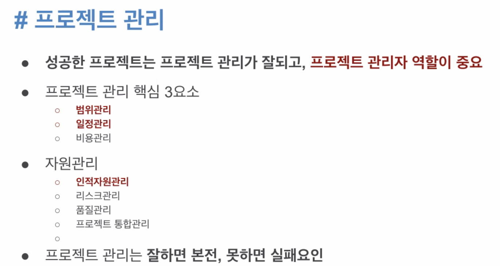
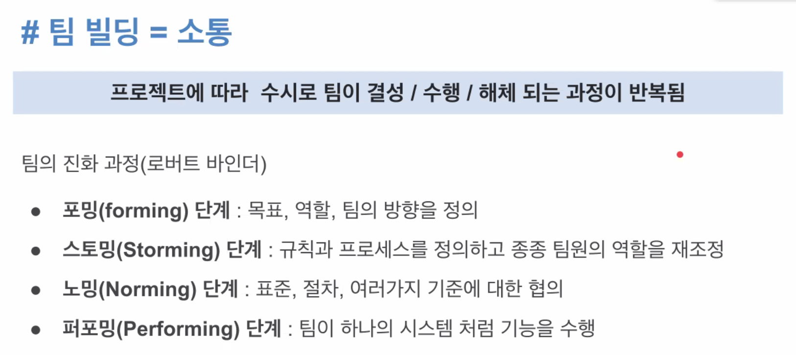
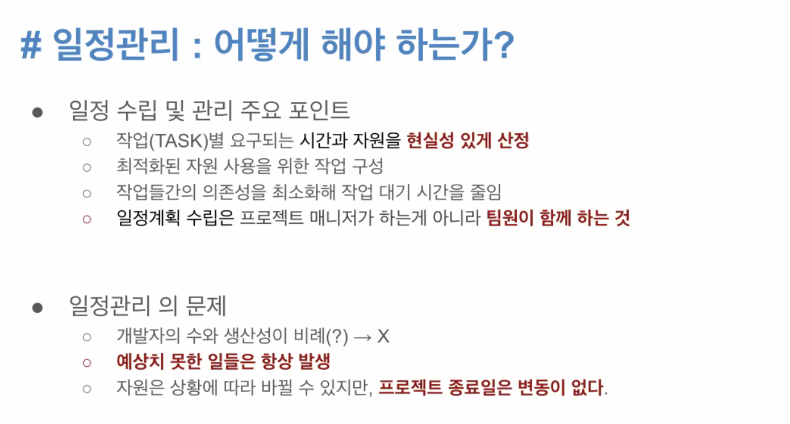
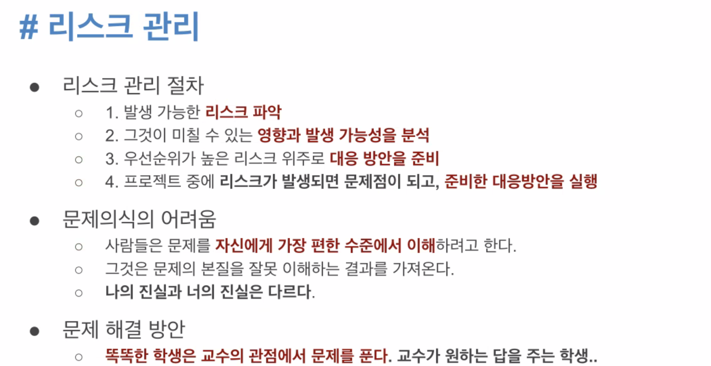
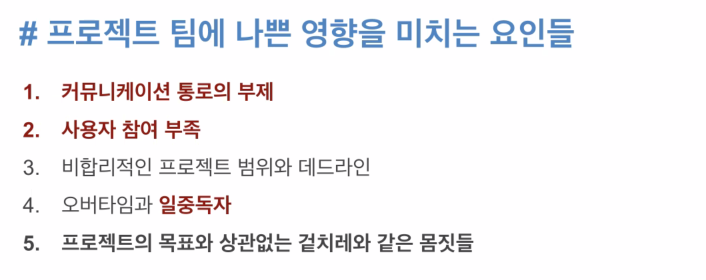
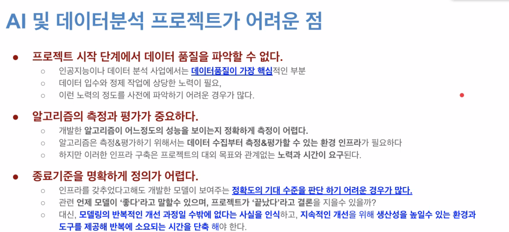

# 1차 멘토링 (8.28)

## 프로젝트, 어떻게 하면 잘할 수 있을까?

> 김상인 (B조 DS멘토)

**프로젝트 목표를 명확히 하고,**

**팀원들과 소통을 통해 결과(산출물)를 만들어가는 과정을 즐겨라**

애자일 영상 : https://www.youtube.com/watch?v=Rj7TLSB7XrU&t=1s

## 취업 관련

> 조태원 (B조 DE멘토)

### 2. 취업은 창과 방패의 싸움

**21KDT 과정 개요**

- **빅데이터 업무 수행을 위한 데이터 아키텍처와 분석 프로그래밍에 대한 기반기술**을 습득할 수 있음
- 데이터 사이언스와 데이터 엔지니어링 2개의 전공 중 전공을 선택, **빅데이터 분석 및 처리와 같은 활용 역량**을 강화할 수 있음
- **현업 기반의 문제해결형 팀프로젝트를 진행**함으로써, 현장에 바로 투입 가능한 실무형 인재로 거듭날 수 있음

뭘했는지 뭘 느꼈는지 내 포지션에 대해 설명을 할 수 있어야함

- 내 무기 => 위의 느낀점, 우수한 산출물

면접관의 감성을 터치할 수 있어야함

- 형식적으로 보이면 안된다

지원시, 아주 구체적으로 설명하는 것이 좋다

- 본인 지원시, 사용자 경험은 딱히 효과가 없다
  - ex) 농심 지원시, 농심라면 얘기
  - ex) 내가 인터넷 연결을 했다

- 내가 지원하는 포지션이 어떤 역할이고 어떤 업무를 하고 어떻게 진행되는지?
  - 업무란 산출물을 내는 업무의 연속 

**사용자 경험 나열만으로는 아쉽다**

**팀, 프로젝트, 포지션에 대한 나의 기여도를 구체적으로 어필하라**

- "<u>내가 배운 지식, 스킬로 어떤 기여를 할 수 있다</u>" 를 표현할 줄 알아야함

### 3. 실력 vs 태도

**신입사원에게 바라는 것**

:1st_place_medal: 배우려는 태도

:2nd_place_medal: 대인관계 및 커뮤니케이션 능력

:3rd_place_medal: 직무관련 전공지식

**기업이 가장 뽑고 싶은 신입사원 유형** 

:1st_place_medal: 바른생활형 - 태도가 좋고 예의가 바른 유형

:2nd_place_medal: 전문가형 - 직무 경험과 지식이 많은 유형

:3rd_place_medal: 제갈공명형 - 지혜가 많은 유형

 

### 요약

1. 취업시장은 매우 어려운 상황이다. 다행히도 **최근 청년고용률이나 취업자수가 반등**하고 있다
2. 당장 연봉/칼퇴에 집착하지말고 평생직장시대에 대비한 유연한 N잡러가 될수있도록 **적성과 관심사**를 발전시켜라
3. 타켓 포지션과 나의 기여도는 **구체적**일수록 좋다
4. 기업에서 신입사원에게 첫번째로 요구하는 것은 "**성실하고 배우려는 태도**"라고 한다

## 사전 질문

Q. 데이터엔지니어에 필요한 기술들이 기업별로 매우 다른걸로 알고 있습니다. 현업에서 가장 중요하게 다루는 툴은 어떤것이고, 또 어떠한 역량을 필요로 해야하는지 알고 싶습니다.

A. 클라우드 기반  -  AWS 오로라DB 다이나모DB redshift 대용량 데이터를 자주 엑세스 하지 않아도 db 

실시간 트랜잭션 db시 cost가 매우 높아 클라우드로 많이 사용

Q. DS/DE로서 현업에서 실제로 하시는 일이 무엇인지 궁금합니다

A. DS/DE 하는일 => DE: 플랫폼 운영, 데이터 관리 , DS: ML,DL, 비즈니스 적용 등

Q. 현업에서는 어떻게 알고리즘을 선택하나요?

A. 현업알고리즘 => 분석과제에 따라 다름..  통장보이스피싱탐지등은 GAN,xAI, DNN 등 , 기업여신 - RNN, 시계열 분석 등

Q. 공공 open api 데이터 수집 말고, 회사 내에서 실시간 데이터 처리를 한다면 그 데이터의 특징과 수집과정이 어떻게 되는지 궁금합니다.

A 공공 API 실시간 => 실시간은 최대한 지양하는 방향임. 상대가 문제가 됐을때 우리 시스템 장애 발생..

Q. 데이터 엔지니어가 하는 전처리와 데이터 사이언스가 하는 전처리와 어떤 차이점이 있나요?

A. DE는 원천을 분석 가능한 형태로 전처리, 마트 생성 등... DS는 분석시 결측치제거 등 사전 작업 전처리...
대략적으로 이렇게 생각합니다.

Q. 취업 방향성

A. 방향성을 구체화하는 과정이 필요함. 취업이 빨리하고 싶다 => 시장을 많이 들여다 봐야 한다.

Q. 본인의 역량이 부족하다고 느낀다면?

A. 관련 자격증 준비 / 대회 로 직무역량을 구체적으로 입증해야 함 어떤 노력을 했고, 그 결과를 보여줘야 함. ADS자격증 등

