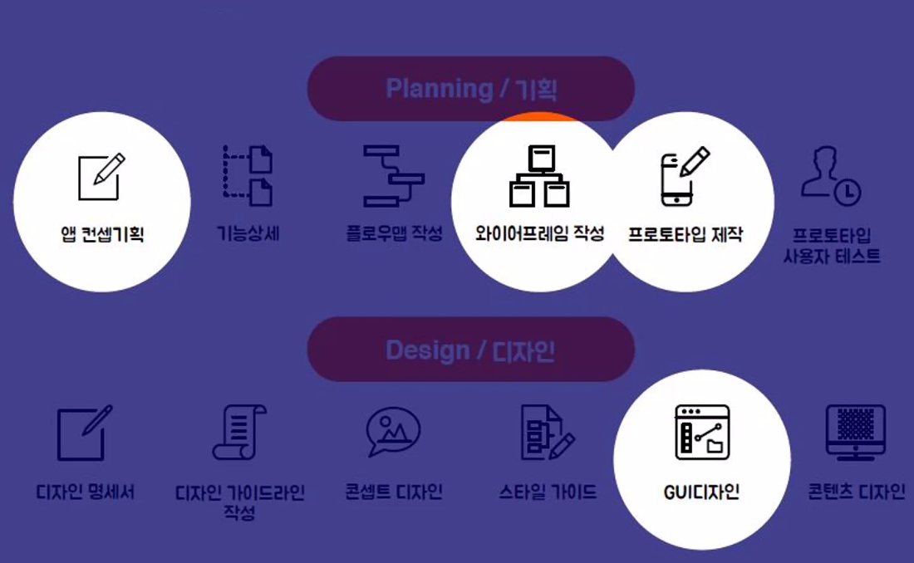

# ux / ui 특강

기획력

스마트폰의 시작 아이폰

삼성 옴니아 데이터 수집 (윈도우) - 안드로이드 개발

ux 는 문화를 만든다

기술을 통한 삶의 질 향상

앱 개발을 위한 [의도] [기획]과 [실행]

PROCESS

STEP1 

<u>문제 찾고 조사하기</u>

STEP2

생각을 구체화 하기

STEP3

해결방안 찾기

STEP4

시각화 하기

ux의 **사용성과 기능**

기능성과 사용성

비효율성

- 평균의 함정

근대중심의 사고방식

- 근대의 핵심 : 대량 생산
  - 대량생산에 적합한 모든 컨텐츠 제작
  - 포스트 모더니즘

미니멀리즘 디자인 

- 인식의 변화 - 장식 제거 

과거 : 선택강요 시대 - 기능성에 중심

현재 : 선택 하는 사용자의 사용성이 중요

경쟁사이(기능성 중심)에서 소비자 중심으로 돌아옴 (아웃소싱 공유 사회)

- 사용자의 경험이 중요해짐

- 사용자의 입장에서의 니즈를 기업체가 직접 파악, 기획, 제작, 투자, 공급

target user 정하는것이 중요 그 후에 contents - marketing 

? 뒤상의 샘?

현대 미술 

ready-made(레디메이드) : 기성품

장소적 권위(좌대) <> 오브제의 권위

메타버스

잊지 말아야 할 UX_UI의 세가지 요소 [피드백]

- Action(행동) > Reaction(반응) > Modifier (수정) > Action(행동)

즉각적인 반응과 적용

잊지 말아야 할 UX_UI의 세가지 요소 [의미의 전달]

다양한 리서치 과정을 통해 의미있는 정보를 캐내야 한다

숨어있는 정보를 찾기 위해 다양한 리서치와 모델 평가 진행

강사_최정수

인사

목적

인간과 기계 차이 - 직감
