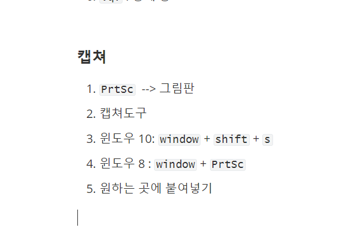

# TIL(Today I Learned)

## 깃허브특강

1. githum.com 설명

2. git 설치, git bash 사용법&활용법

3. typora 설치 & 활용법

4. unix/Linux와 git 명령어 공부

 

## 깃허브특강2

nano emacs vim


#### 기본 에디터(git commit 했을 때 뜨는 에디터)를 vim으로 바꾸는 명령어

`git config --global core.editor "vim"`

#### vim - command mode

1. `esc` 
2. `i` : insert
3. `:w` : 저장
4. `:q` : 종료
5. `:wq` : 저장 후 종료
6. `:q!` : 강제 종료


#### 캡쳐

1. `PrtSc `  --> 그림판
2. 캡쳐도구
3. 윈도우 10: `window` + `shift` + `s`
4. 윈도우 8 : `window` + `PrtSc` 

5. 원하는 곳에 붙여넣기



`ctrl`+`,` 설정 

+ when insert... > assets경로로 이미지 복사
+ 가능하다면 상대적 위치 사용


#### branch & merge

+ commit 는 merge 이용 instead of 삭제
  + 삭제, missing link발생 가능

+ checkout은 지정한 브랜치로 이동. HEAD포인터를 지정 브랜치로 이동

+ switch는 checkout과 같이 이동하는 기능이다. 
  + checkout 은 상하좌우로 이동한다면, switch는 좌우로만 이동한다.
+ commit된 branch 중 하나로 HEAD 이동
  + `git log (--oneline)`
  + 이동하고자 하는 branch 이름 기억(ex. `75f5659` )
  + `git checkout 75f5`
  + 그 후 `git checkout (이동하고자 하는 위치)`
+ commit 이름 바꾸기
  + pycharm이용시, git탭 들어가서 Edit Commit Message...(F2)
  + terminal 이용시, `git commit --amend`
    + vim 에서 `i`입력후  수정 
    + 수정 완료시 `:wq`으로 빠져나오기


#### remote

repo(repository) : upgraded 폴더

Local 

---------------------------------------------

Remote 

1. 리모트 리포 생성
2. 로컬 -> 리모트 화살표 지정(이름지정)
3. 로컬 내용을 리모트에 업로드 한다.

```
git remote add origin https://github.com/wh-yenny-choi/remote_repo.git

gir remotre add <이름> <url>

git branch -M main
git push -u origin main
```


```
git remote -v
```


``` 
git push origin master
git push <이름> <브랜치>
이후 이 단계만 반복
<브랜치> 확인은 `git branch`
```

+ push  <stand
+ pull < sit


#### git remote add + (사용자 이름)  이름 스펠링 실수

1. `git remot remove orgin`

2. `git remote -v`

3. `git remot add origin https://github.com/`

   

#### git remote add + (사용자 이름)  이름 변경

`git remote rename <원래이름> <수정이름>`

Ex)`git remote rename origin original`

+ git remote --help 활용


#### 협업 오류

 ! [rejected]        master -> master (fetch first)
error: failed to push some refs to 'https://github.com/wh-yenny-choi/team-pjt.git'
hint: Updates were rejected because the remote contains work that you do
hint: not have locally. This is usually caused by another repository pushing
hint: to the same ref. You may want to first integrate the remote changes
hint: (e.g., 'git pull ...') before pushing again.
hint: See the 'Note about fast-forwards' in 'git push --help' for details.


#### 계정기록 남아있을때 오류

remote: Permission to chaerui7967/K_Digital_Training.git denied to ChaeRui.
fatal: unable to access 'https://github.com/chaerui7967/K_Digital_Training.git

1. 자격 증명 관리
2. 웹 자격 증명 관리
3. windows 자격 증명
4. 일반 자격 증명 - git
5. 제거
6. `git config --global user.email` 이메일주소 다시 증명


#### 협업 과정

1. clone
2. 피처 브랜치 생성
3. 수정
4. `git add (.) && git commit -m '()'`
5. `git push <이름> <피처브랜치>`
6. github merge
7. `git pull <이름> <브랜치>`
8. `git branch -d <피처브랜치>`


#### 수업 +

`git merge --help`

1일 1커밋

TIL

`mkdir`는 커밋 해당 조건이 아님 (`touch`는 해당)

home이 master 됐을때, `rm -rf .git` 로 mater권한 삭제

`pull request` <=> merge request

https://backlog.com/git-tutorial/kr/